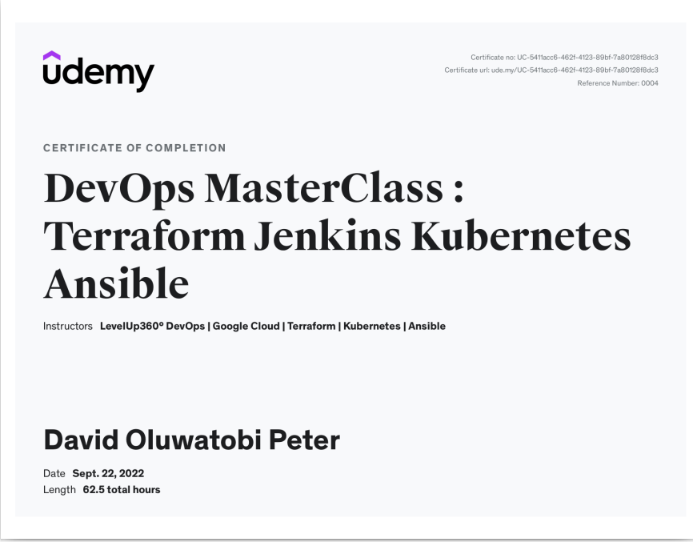
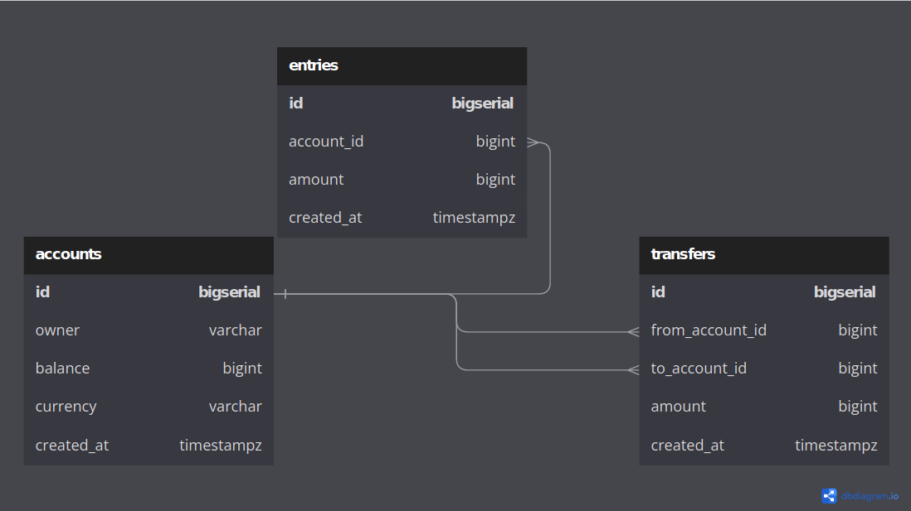

# Reason Behind the Project

I recently finished an Udemy devops master class. This project affords me the opportunity to have a better hands on practice with the skills acquired (plus my backend experience and knowledge). This project is a simple banking operation simulation - it covers operations such as account creation, deposits and transfer of funds.

I'm also using an [udemy course](/https://www.udemy.com/course/backend-master-class-golang-postgresql-kubernetes/) that covers few functionalities with some of the technologies listed below for a guide.

This md file will serve as a documentation. It will also serve as a blog post documenting my experiences, new knowledge gained, bugs and how I got them resolved.

## Technologies

Programming Language - GoLang with Gin Framework
Database - PostgreSQL
Operating System - Linux (Ubuntu Distribution)
Container - Docker
Container Orchestation - Kubernetes
CI/CD - Github Actions
Cloud Services - AWS
IAC - Terraform
Configuration Management - Ansible

## MakeFile

Following somewhat the ideals of automation, a makefile has been created to have an easy implementation of long and repetitve commands. The file's implementation practices the protection sensitive details such as database username and password. In its operation, it gets the needed details from the os environment (especially for cloud). I created two secret files .postgresUser & .postgresPassword.

I had trailing white spaces at the end of target1 & target2 which created a bug - trailing white spaces in my database url.

## Database Structure

## Database Migration

[Migrate](/https://pkg.go.dev/github.com/golang-migrate/migrate/v4), a golang package is what I'm employing to run migrations.
